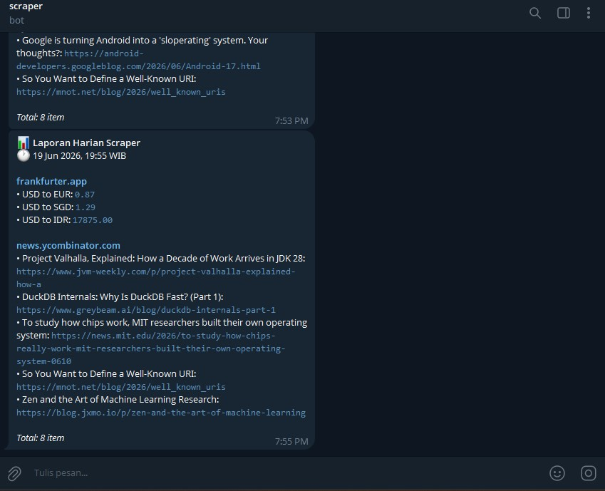

# gcp-scraper-cron

A scheduled web scraper that runs daily on Google Cloud Platform using Cloud Functions and Cloud Scheduler. Results are delivered to Telegram automatically — no server required, no laptop needed.

---

## What it does

The scraper wakes up on a cron schedule, pulls data from the web (exchange rates, prices, news, stock availability — whatever you point it at), formats the results, and sends them to a Telegram bot. When it's done, it shuts down. You pay nothing while it's idle.

Out of the box it scrapes USD/IDR/EUR/SGD exchange rates from a free public API. Swap in any source you want by editing one file.

---

## Screenshots

**GCP Cloud Functions dashboard**


**Cloud Scheduler job**


**Telegram notification result**


**GitHub Actions deploy log**


> Add your own screenshots to `docs/screenshots/` after deploying.

---

## Architecture

```
GitHub Repository
      │
      │  push to main
      ▼
GitHub Actions
      │
      │  gcloud deploy
      ▼
Cloud Functions Gen2 (Go 1.21)      ◄──── Cloud Scheduler (daily cron)
      │
      ├── internal/scraper      run targets from configs/targets.json
      ├── internal/store        save results to Firestore
      └── internal/notifier     send results to Telegram
            │                         │
            ▼                         ▼
       Firestore               Your Telegram
            │
            ▼
   Dashboard (Cloud Run)  ◄── read-only, shows run history
```

---

## Cost

| Service | Usage | Free tier | Cost |
|---|---|---|---|
| Cloud Functions Gen2 | 30 calls/month | 2M calls/month | free |
| Cloud Scheduler | 1 job | 3 jobs free | free |
| Cloud Run (dashboard) | low traffic, scales to zero | 2M requests/month | free |
| Firestore | a few hundred writes/month | 20K writes/day, 50K reads/day | free |
| Egress network | < 1 GB/month | 1 GB/month | free |
| Cloud Build | ~5 min/deploy | 120 min/day | free |
| **Total** | | | **$0/month** |

Set a billing alert at $5 in GCP Console just in case.

---

## Project structure

```
gcp-scraper-cron/
├── function.go                    entry point for Cloud Functions
├── go.mod
├── configs/
│   └── targets.json               scrape target definitions — edit this to add/change sources
├── internal/
│   ├── scraper/
│   │   ├── scraper.go             orchestrator — runs all enabled targets
│   │   ├── config.go              target schema and config loader
│   │   ├── json_scraper.go        handles type: "json" targets
│   │   └── html_scraper.go        handles type: "html" targets
│   ├── store/
│   │   └── firestore.go           saves scrape results to Firestore
│   ├── notifier/
│   │   └── telegram.go            formats and sends Telegram messages
│   └── envloader/
│       └── envloader.go           loads .env for local development only
├── cmd/
│   ├── deploy/
│   │   └── main.go                local test runner (no deploy needed)
│   └── dashboard/
│       ├── main.go                read-only web UI for run history
│       ├── templates.go           HTML templates for the dashboard
│       └── Dockerfile             container build for Cloud Run
├── docs/
│   └── screenshots/               add your screenshots here
└── .github/
    └── workflows/
        └── deploy.yml             CI/CD pipeline
```

---

## Setup

### Prerequisites

- Google Cloud account (free tier works, comes with $300 credit)
- GitHub account
- [gcloud CLI](https://cloud.google.com/sdk/docs/install) installed
- Go 1.21+
- Telegram account

---

### 1. Create a GCP project

```bash
gcloud auth login
gcloud projects create your-project-id
gcloud config set project your-project-id

gcloud services enable cloudfunctions.googleapis.com
gcloud services enable cloudscheduler.googleapis.com
gcloud services enable cloudbuild.googleapis.com
gcloud services enable run.googleapis.com
```

---

### 2. Create a service account for GitHub Actions

```bash
gcloud iam service-accounts create github-deployer \
  --display-name="GitHub Actions Deployer"

gcloud projects add-iam-policy-binding your-project-id \
  --member="serviceAccount:github-deployer@your-project-id.iam.gserviceaccount.com" \
  --role="roles/cloudfunctions.developer"

gcloud projects add-iam-policy-binding your-project-id \
  --member="serviceAccount:github-deployer@your-project-id.iam.gserviceaccount.com" \
  --role="roles/cloudscheduler.admin"

gcloud projects add-iam-policy-binding your-project-id \
  --member="serviceAccount:github-deployer@your-project-id.iam.gserviceaccount.com" \
  --role="roles/run.admin"

gcloud projects add-iam-policy-binding your-project-id \
  --member="serviceAccount:github-deployer@your-project-id.iam.gserviceaccount.com" \
  --role="roles/iam.serviceAccountUser"

gcloud projects add-iam-policy-binding your-project-id \
  --member="serviceAccount:github-deployer@your-project-id.iam.gserviceaccount.com" \
  --role="roles/datastore.user"

gcloud projects add-iam-policy-binding your-project-id \
  --member="serviceAccount:github-deployer@your-project-id.iam.gserviceaccount.com" \
  --role="roles/cloudbuild.builds.editor"

# Export the key — you'll paste this into GitHub Secrets
gcloud iam service-accounts keys create key.json \
  --iam-account=github-deployer@your-project-id.iam.gserviceaccount.com
```

---

### 3. Create a Telegram bot

1. Open Telegram and search for **@BotFather**
2. Send `/newbot` and follow the prompts
3. Copy the **token** you receive
4. Send any message to your new bot
5. Open this URL in a browser to get your chat ID:
   ```
   https://api.telegram.org/bot<YOUR_TOKEN>/getUpdates
   ```
6. Find `"chat":{"id": 123456789}` — that number is your chat ID

---

### 4. Add GitHub Secrets

Go to your repo on GitHub: **Settings → Secrets and variables → Actions → New repository secret**

| Secret | Value |
|---|---|
| `GCP_SA_KEY` | Full contents of `key.json` |
| `GCP_PROJECT_ID` | `your-project-id` |
| `TELEGRAM_TOKEN` | Token from BotFather |
| `TELEGRAM_CHAT_ID` | Your chat ID number |
| `SCHEDULER_SECRET` | Any random string, e.g. `s3cr3t-abc` |

---

### 5. Push and deploy

```bash
git init
git add .
git commit -m "initial commit"
git branch -M main
git remote add origin https://github.com/your-username/gcp-scraper-cron.git
git push -u origin main
```

GitHub Actions deploys automatically. Check the **Actions** tab for progress.

---

## Running locally

Install dependencies first:

```bash
go mod tidy
```

Copy `.env.example` to `.env` and fill in your values:

```
TELEGRAM_TOKEN=token_from_botfather
TELEGRAM_CHAT_ID=your_chat_id
SCHEDULER_SECRET=any_random_string
```

Then run:

```bash
go run ./cmd/deploy
```

The app reads `.env` automatically. The `.env` file is listed in `.gitignore` so it will never be committed to GitHub.

---

**If you prefer setting env variables manually instead:**

**Windows (CMD):**
```cmd
set TELEGRAM_TOKEN=your-token
set TELEGRAM_CHAT_ID=your-chat-id
go run ./cmd/deploy
```

**Windows (PowerShell):**
```powershell
$env:TELEGRAM_TOKEN="your-token"
$env:TELEGRAM_CHAT_ID="your-chat-id"
go run ./cmd/deploy
```

**Mac/Linux:**
```bash
export TELEGRAM_TOKEN=your-token
export TELEGRAM_CHAT_ID=your-chat-id
go run ./cmd/deploy
```

---

## Adding a new scraper target

Targets are defined in `configs/targets.json` — no Go code changes needed for most cases. The scraper supports two target types: `json` (API endpoints) and `html` (web pages with repeating elements).

### JSON API target

Use this when the source returns structured JSON (most public APIs).

```json
{
  "name": "Bitcoin Price",
  "enabled": true,
  "type": "json",
  "url": "https://api.coindesk.com/v1/bpi/currentprice.json",
  "source": "coindesk.com",
  "json_fields": {
    "BTC to USD": "bpi.USD.rate_float"
  },
  "json_value_format": "$%.2f"
}
```

`json_fields` maps an output label to a dot-path inside the response. `rates.IDR` reads `response["rates"]["IDR"]`. `json_value_format` is a Go `Printf` format applied to the value — use `%.2f` for numbers, `%s` for text, `%v` if unsure.

### HTML page target

Use this for pages without a public API — product listings, news pages, job boards. Find the right selectors using your browser's DevTools (right-click an element → Inspect).

```json
{
  "name": "Laptop Listings",
  "enabled": true,
  "type": "html",
  "url": "https://example.com/laptops",
  "source": "example.com",
  "item_selector": ".product-card",
  "title_selector": ".product-title",
  "value_selector": ".product-price",
  "max_items": 10
}
```

`item_selector` matches each repeating card/row on the page. `title_selector` and `value_selector` are searched *inside* each matched item — they're relative selectors, not page-wide ones. `max_items` caps how many results to keep (omit for no limit).

By default, `value_selector` extracts the matched element's text. To pull an attribute instead — most commonly a link's `href` — add `value_attr`:

```json
{
  "name": "Hacker News - Top Stories",
  "enabled": true,
  "type": "html",
  "url": "https://news.ycombinator.com/",
  "source": "news.ycombinator.com",
  "item_selector": ".athing",
  "title_selector": ".titleline > a",
  "value_selector": ".titleline > a",
  "value_attr": "href",
  "max_items": 5
}
```

This gives you the article title paired with its actual link, instead of the title repeated twice.

### Enabling, disabling, testing

- Set `"enabled": false` to turn a target off without deleting its config
- Run `go run ./cmd/deploy` locally to test before deploying — a broken selector shows up immediately in the output
- If a target's selector stops matching (the site changed its layout), that target is skipped and logged — it won't take down the other targets

### When you need custom logic

Some sources need more than selectors can express — pagination, auth headers, JS-rendered content. For those, add a Go function in `internal/scraper/` following the pattern in `json_scraper.go` or `html_scraper.go`, then wire it into `runTarget()` in `scraper.go` under a new `TargetType`.

---

## Cron schedule

Edit `--schedule` in `.github/workflows/deploy.yml`:

| Schedule | Runs |
|---|---|
| `0 0 * * *` | Daily at 07:00 WIB (00:00 UTC) |
| `0 22 * * *` | Daily at 05:00 WIB (22:00 UTC) |
| `0 */6 * * *` | Every 6 hours |
| `0 0 * * 1` | Every Monday |
| `*/30 * * * *` | Every 30 minutes |

Cloud Scheduler uses UTC. Indonesia WIB is UTC+7, so subtract 7 hours from your target time.

---

## Viewing logs

```bash
gcloud functions logs read scraper-harian \
  --region=asia-southeast2 \
  --limit=50
```

---

## Dashboard

A small read-only web page showing scrape run history, deployed separately as a Cloud Run service.

**Pages:**
- `/` — list of the 20 most recent runs, with status and item count
- `/runs/{run_id}` — items scraped in that specific run

**Getting the URL after deploy:**

```bash
gcloud run services describe scraper-dashboard \
  --region=asia-southeast2 \
  --format='value(status.url)'
```

GitHub Actions also prints this URL at the end of each deploy — check the workflow run logs.

**Running it locally:**

Add these to your `.env` file (alongside the Telegram and scheduler values):

```
GCP_PROJECT_ID=your-project-id
GOOGLE_APPLICATION_CREDENTIALS=./key.json
```

Then run:

```bash
go run ./cmd/dashboard
```

Open `http://localhost:8080`.

The dashboard is read-only and has no authentication by default — anyone with the URL can view run history. If the data is sensitive, restrict access with `--no-allow-unauthenticated` on the Cloud Run deploy and use [Identity-Aware Proxy](https://cloud.google.com/iap) or a similar layer in front of it.

---

## Common issues

**`go.sum` missing entries on first run**

```bash
go mod tidy
```

**Deploy fails in GitHub Actions**

Check that all 5 secrets are set correctly. Open the failed workflow run in the Actions tab and read the error output.

**No Telegram message received**

Make sure you sent at least one message to the bot before testing — bots cannot initiate conversations. Verify your token and chat ID are correct:

```bash
curl https://api.telegram.org/bot<TOKEN>/getMe
```

**Function timeout**

Default is 300 seconds. For heavy scraping jobs, add `--timeout=540s` to the deploy command (Gen2 max is 9 minutes).

---

## Tech stack

| | |
|---|---|
| Language | Go 1.21 |
| Compute | GCP Cloud Functions Gen2, Cloud Run |
| Scheduler | GCP Cloud Scheduler |
| Storage | GCP Firestore |
| HTML parsing | goquery |
| CI/CD | GitHub Actions |
| Notifications | Telegram Bot API |
| Framework | functions-framework-go v1.8 |

---

## License

MIT
